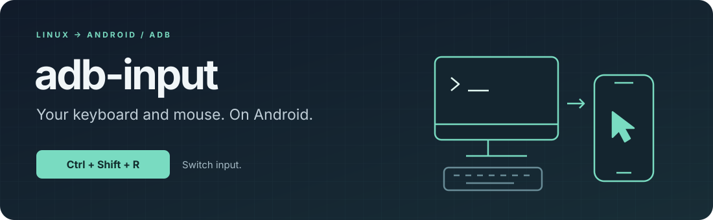

<p align="center">
  
</p>

<p align="center">
  <a href="https://github.com/smturtle2/adb-input/actions/workflows/ci.yml"></a>
  
  <a href="LICENSE"></a>
</p>

<p align="center">
  Share your Linux keyboard and mouse with Android over USB or wireless ADB.<br>
  <strong>Ctrl + Shift + R</strong> switches input between desktop and phone.
</p>

<p align="center">
  <a href="#quick-start">Quick start</a> · <a href="docs/guide.md">User guide</a> · <a href="docs/development.md">Development</a>
</p>

- **One terminal, one shortcut.** Pick a device, start a session, switch when you need it.
- **X11 or Wayland.** Direct Linux input capture, with device hotplug support.
- **No APK or Bluetooth.** A temporary Android agent travels with the desktop binary.

## Quick start

You need `adb`, authorized Android USB/wireless debugging, and read access to Linux
keyboard and mouse devices. Android must allow the ADB shell to access `/dev/uhid`.
See [setup and permissions](docs/guide.md#linux-permissions-and-scope).

Install or update from the [latest release](https://github.com/smturtle2/adb-input/releases/latest):

```sh
curl -fsSL https://raw.githubusercontent.com/smturtle2/adb-input/main/install.sh | sh
```

The installer verifies checksums and installs to `~/.local/bin`. Add that directory
to your `PATH`, then launch:

```sh
adb-input doctor
adb-input
```

Select a device and choose **Start control**. Input starts on **DESKTOP**.
Wireless destinations are remembered; choose one later and enter only its new port.
Press and release **Ctrl+Shift+R** to switch to **PHONE**, and again to return.
Release all held keys when switching. **Ctrl+C** or **Esc** in desktop mode returns
to the menu. Opening the menu alone does not capture input.

<details>
<summary><strong>Prefer explicit commands?</strong></summary>

```sh
adb-input pair PHONE_IP:PAIR_PORT       # enter the pairing code at the prompt
adb-input connect PHONE_IP:CONNECT_PORT
adb-input devices
adb-input run --device SERIAL
adb-input run --connect PHONE_IP:PORT --sensitivity 1.5
```

Pairing and connection ports are different. Run `adb-input --help` for all commands.

</details>

## Compatibility

| | Support |
| --- | --- |
| Host | Linux x86_64 / ARM64; evdev input access required |
| Android | arm64-v8a / x86_64; ADB shell access to UHID required |
| Keyboard | Standard keys, modifiers, Korean language keys; six-key rollover |
| Mouse | Relative motion, absolute mouse conversion, five buttons, vertical scroll |

Vendor policies can differ; phone root was not needed on the tested Galaxy S25.
ARM64 Linux hosts and other phone vendors still need hardware validation.
Media keys, horizontal scrolling, clipboard transfer and automatic ADB reconnection
are not implemented. The desktop application may also receive the toggle shortcut.
[Full behavior and limitations →](docs/guide.md)

## Build

With rustup installed:

```sh
cargo xtask build --target x86_64-unknown-linux-musl
./target/x86_64-unknown-linux-musl/release/adb-input
```

Use `aarch64-unknown-linux-musl` for ARM64. `xtask` embeds both Android agents;
plain `cargo build` produces a development binary without them.
[Architecture, tests and packaging →](docs/development.md)

## License

[EUPL-1.2](LICENSE) · [Third-party notices](THIRD_PARTY.md)
